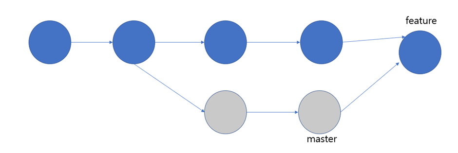

# rebase 와 merge

1. &#x20;**rebase와  merge의 차이점**

&#x20;

**merge**는 커밋순서를 바꾸지 않는다. 존재하는 브랜치가 변경되지 않는다. 현재 브랜치 구조를 그대로 유지 하고 다른 브랜치의 내용을 반영해서 새로운 병합 커밋을 추가하는 것이다.

**rebase**는 어떤 특정 브랜치를 base로 커밋 이력을 재 정렬한다는 명령어이다. 재정렬되는 commit 이력이기 때문에, 재정렬되는 commit 이력에는 이전과는 다른 새로운 해쉬 ID가 부여 된다. (master 브랜치에서 다른 브랜치를 기준으로 rebase를 하는 경우는 피하는게 좋다)

.png>)
